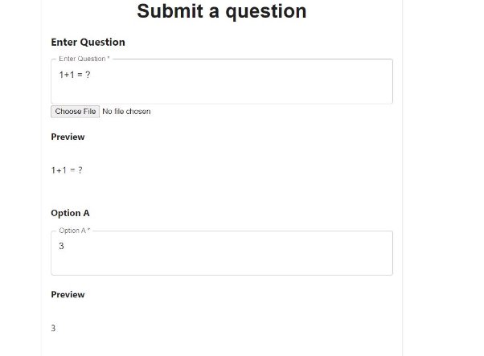

**User Documentation: Virtual Labs Question Bank** 

**Introduction** 

The Virtual Labs Question Bank allows users to access a wide array of Questions. They can download these questions or even upload their own.

**Target User** 

This service is targeted towards teachers/professors at all levels of education. **User Interface** 

1. **Login** 

   Users Land on the login screen. 

   They can log in with their email id and password or a google log in. If they don’t have an account the can sign up.

   
   Login Screen

2. **Question search** 

   Users can search for questions using tags and difficulty level.

   Questions can also be filtered by the person who has submitted it. 

   The number of questions per page can also be selected.

   Upon clicking on the ‘+’ sign next to a question it is added to the Download List. Once the ‘+’ is clicked it turns into a ‘-‘ which when clicked removes the question from the Download List. 

   
   Search Page

   Upon clicking on a question, it is displayed in its entirety. All the options along with the correct option are displayed. If the question has an image clicking on it enlarges it. 

   
   Sample Question

   The option to add the question to the question list is present here as well 

   
   Bottom of Question Page

3. **Download List** 

   The questions selected to be downloaded are displayed here.

   A question can be removed from the list by clicking on the ‘x’ next to it. 

   Upon clicking on Download Now, a json file with the questions is downloaded.

   
   Download Page

   
   Downloaded Json

4. **Add Question** 

   This page is used to let the users add questions to the database. 

   The first field takes in the question. 

   Subsequent fields take in various option and the explanations accompanying each of them. 

   Finally, the correct option has to be highlighted, tags must be added and the difficulty must be set. 

   Upon selecting submit the questions are added to the database.

   

   

   
   Question Submit Page

5. **Profile Page** 

   Upon clicking on the indicated area on the navbar the user is presented with the option to go to the Profile Page. 
   

   ![ref1]
   Profile Option

   Here one can view the number of credits they have. 

   Credits are spent to download questions and credits are gained by submitting questions. 

   They can also change their password through this page.

   
   Profile Page

   
   Change Password

6. **Log out** 

   Upon clicking on the indicated area on the navbar the user is presented with the option to log out. 

   Upon clicking logout they are sent back to the log in page.

   

   ![ref1]
   Logout Option

[ref1]: Aspose.Words.66f568cb-6f40-48db-a5da-b8b9f23ab8c6.012.png
